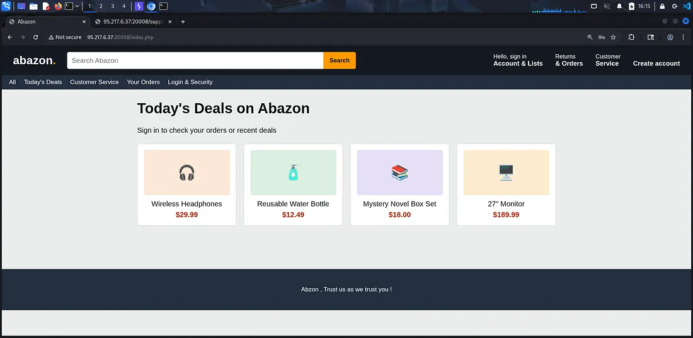
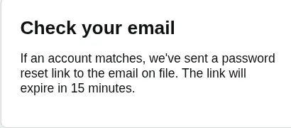
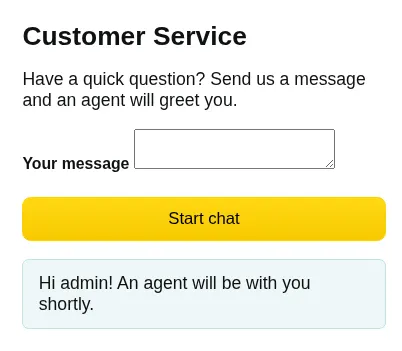
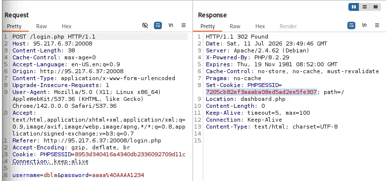
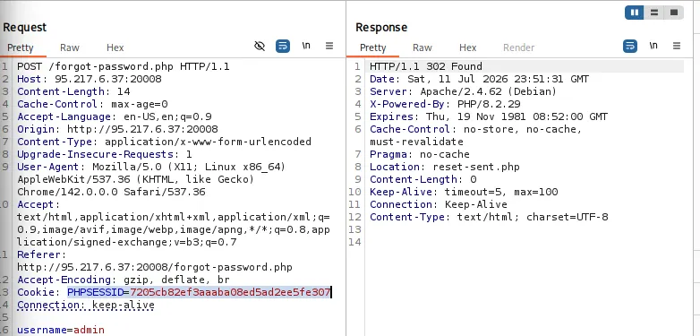
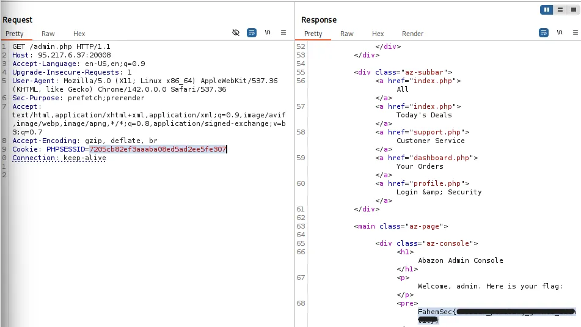

+++
title = "Abazon Web Challenge | FahemSec"
date = "2026-10-01"
tags = ["CTF", "Web", "Session-Puzzling", "Auth-Bypass"]
description = "Blackbox challenge from FahemSec platform, using Session Variable Overwrite via Forgot Password (Session Puzzle) to access admin.php and get the flag."
draft = false
+++

Hey folks, did your about **Session Puzzling Vulnerability** before?? 
Continue and explore. Our challenge today is a **blackbox** challenge from [**FahemSec**](https://fahemsec.com/) platform, using **Session Variable Overwrite via Forgot Password (Session Puzzle)** and get the **flag**. Let's go diving and see :)

> **Challenge Description:** Some bugs are easy to spot on whitebox but life is not always roses . No **bruteforcing** or **fuzzing** needed as always , flag is waiting for you at `admin.php` 

 After landing on the challenge you will the `index.php`

# Application Overview

The target is a **PHP e-commerce clone** called **Abazon**.
The pages are:

- `index.php` → Home Page
- `register.php` → Create new user 
- `login.php` → Login page 
- `forgot-password.php` → Password reset, takes `username` as a parameter
- `reset-sent.php` → Confirmation after reset request
- `support.php` → Chatting with customer services 
- `dashboard.php` → Orders page **(requires login)**
- `profile.php` → Change password **(requires login)**
- `admin.php` → Admin panel with flag **(requires admin)**
- `cart.php` → Shopping cart
- `logout.php` → Logout 

That's good, now we know all about the application, I started visiting all pages and sent requests to see how the backend handles each request.

- `Admin.php`: Response with `403` which needs login.
- All pages return `200` (`login`/`register` redirect logged-in users to dashboard)
- `Cart.php`: Just a dummy page to make the app a bit realistic hahaha.

Let's make an account to see the dashboard, I created a user using `dblm:aa@AA1234` , then logged in with these credentials.
We have a valid session for my username:

`Cookie: PHPSESSID=36d5....`

Tbh, I burnt sometimes exploring the application with AI to catch anything as it **blackbox challegne** and I want to catch the blood :( but I didn't reach anything so I decided to test manually.
I tested many vulnerabilities in many parameters and functions such as **SQL Injection**, **NoSQL Injection**, **XSS**, and such. The app has many **rabbit holes** btw.
When testing with non user I catch something:
When sending a request to `forgot-password.php` and typed any user for example `admin` → we have been redirected to `reset.php` and and if you checked the request in **burp**, you will find that the application created a session for this request **(A session for admin)**.

The next interesting thing is when chatting with customer services after this step we got that 

**THAT'S VERY INTERESTING**, the application used the **same session** to perform many actions (the session for `forget-password` and the session for customer services and this is the main logic of **Session Puzzling Vulnerability** 

# What is Session Puzzling ?

**Session Variable Overloading (also known as Session Puzzling)** is an application level vulnerability which can enable an attacker to perform a variety of malicious actions, including but not limited to:

- **Bypass** efficient authentication enforcement mechanisms, and **impersonate legitimate users**.
- **Elevate the privileges** of a malicious user account, in an environment that would otherwise be considered foolproof.
- **Skip over qualifying phases** in multi-phase processes, even if the process includes all the commonly recommended code level restrictions.
- **Manipulate server-side values** in indirect methods that cannot be predicted or detected.
- **Execute traditional attacks** in locations that were previously unreachable, or even considered secure.

This vulnerability occurs when an application uses the **same session variable for more than one purpose**. An attacker can potentially access pages in an order unanticipated by the developers so that the session variable is set in one context and then used in another
Check the reference at the end of the write-up.
This catching leads us to use the we catch the **admin cookie** after sending a request to **forget password** again but after log in with a valid user and the **admin session** with **overwrite** our normal user session 

## The Attack Approach 

1. Register a new user and save the cookie `Cookie: PHPSESSID=36d5`
2. Login with this user.
3. Now we should make a `POST` request to `forget-password.php` with `username admin` to create overwrite the variable of username with admin and use it to access `admin.php`

> There is something important here:
> We should drop some requests or make these requests manually in the **repeater** and **Don't Follow Redirections**, why??
>  After sending a request to `forget-password`, the **session with admin username variable is created** and it immediately redirect us to `reset.php` which is return the session to our user session and the admin session terminated.

**SO** to perform the attack clearly, that's what should happen:

1. Send a log in request in **repeater** manually and save the session.

2. Then send a `forgot-password` → **overwrite our session** **(no redirection)**

3. Access `admin.php` → get the **flaaag** 

# Reference 

[OWASP - Testing for Session Puzzling](https://owasp.org/www-project-web-security-testing-guide/latest/4-Web_Application_Security_Testing/06-Session_Management_Testing/08-Testing_for_Session_Puzzling)
